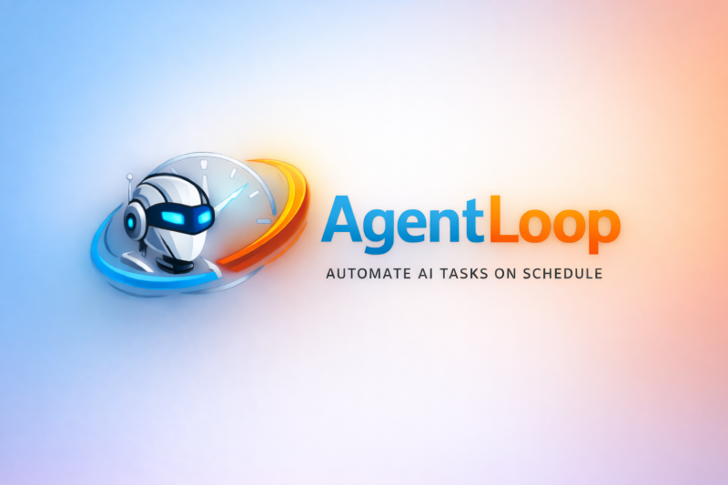

<p align="center">
  
</p>

<p align="center">
  <a href="https://github.com/sarfraznawaz2005/diffy/actions/workflows/ci.yml">
    
  </a>
  <a href="LICENSE">
    
  </a>
</p>

# AgentLoop

AgentLoop is a powerful Windows desktop application built with .NET 8 and WPF that enables you to schedule and automate recurring AI-powered tasks. It acts as a scheduling gateway, executing user-defined AI agent commands (such as Claude, Gemini CLI, OpenCode, Qwen, etc.) on flexible schedules using the native Windows Task Scheduler.

## ✨ Features

- **Flexible Scheduling**: Supports multiple schedule types including minute-based, hourly, daily, weekly, and monthly.
- **AI-Powered Tasks**: Execute any CLI-based AI agent or specialized scripts with custom prompts.
- **Windows Task Scheduler Integration**: Leverages the robust Windows infrastructure for reliable task execution.
- **Rich Logging**: Automatically captures and parses output/errors from every run into timestamped log files.
- **System Tray Integration**: Runs quietly in the background, minimizes to the system tray, and provides balloon notifications for job completions.
- **Configuration Management**: Persistent settings and job definitions stored in an easy-to-manage INI format.
- **Ad-hoc Execution**: Run jobs manually at any time outside of their schedule.

## 🛠️ Technology Stack

- **Framework**: .NET 8.0 (Windows-only)
- **UI**: WPF (Windows Presentation Foundation) with MVVM Architecture
- **Language**: C# 12
- **Scheduling**: `Microsoft.Win32.TaskScheduler`
- **Data Storage**: INI file-based configuration via `ini-parser-netstandard`
- **Testing**: xUnit with Moq

## 📂 Project Structure

- `src/AgentLoop.Core`: Business logic, service implementations, and interfaces.
- `src/AgentLoop.Data`: Data models (POCOs) and INI configuration services.
- `src/AgentLoop.UI`: WPF presentation layer, including ViewModels, Views, and Styles.
- `src/AgentLoop.Tests`: Comprehensive unit test suite.

## 🚀 Getting Started

### Prerequisites

- [Windows 10/11](https://www.microsoft.com/windows)
- [.NET 8.0 SDK](https://dotnet.microsoft.com/download/dotnet/8.0)
- [Visual Studio 2022](https://visualstudio.microsoft.com/vs/) (Optional, for development)

### Build and Run

To build the entire solution:

```bash
dotnet build AgentLoop.sln
```

To run the application:

```bash
dotnet run --project src/AgentLoop.UI/AgentLoop.UI.csproj
```

### Developing

1. Open `AgentLoop.sln` in Visual Studio 2022.
2. Set `AgentLoop.UI` as the Startup Project.
3. Ensure you have the necessary AI CLI tools (like Claude or Gemini CLI) installed and globally accessible if you plan to use them in your jobs.

## 🧪 Testing

Run discovery and execute all unit tests:

```bash
dotnet test src/AgentLoop.Tests/AgentLoop.Tests.csproj
```

## 📦 Deployment

AgentLoop can be published as a framework-dependent application for a smaller footprint (requires .NET 8 runtime):

```bash
# Using the provided build script
.\build-win.bat

# Manual publish (example for x64)
dotnet publish src/AgentLoop.UI/AgentLoop.UI.csproj -c Release -r win-x64 --self-contained false
```

## 🤝 Contributing

Contributions are welcome! Please ensure you follow the coding style and guidelines defined in `AGENTS.md` and `CLAUDE.md`.

## 📜 License

This project is licensed under the MIT License - see the LICENSE file for details (if applicable).
